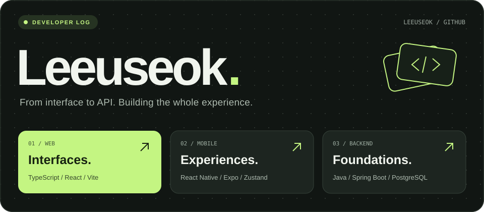

 

**화면부터 API까지, 하나의 서비스로 연결합니다.** 
TypeScript로 웹과 모바일을, Java와 Spring Boot로 백엔드를 개발합니다.

[Email ↗](mailto:dntjr4646@gmail.com) &nbsp; · &nbsp; [Instagram ↗](https://www.instagram.com/2rain_stone) &nbsp; · &nbsp; [Repositories ↗](https://github.com/Leeuseok?tab=repositories)

 

### 01 &nbsp; / &nbsp; In progress

<table>
<tr>
<td width="50%" valign="top">
<h3>Web → Mobile</h3>

React 기반 서비스와 관리자 화면, React Native · Expo 모바일 앱을 만듭니다.

FOCUS &nbsp; TypeScript · Zustand · TanStack Query
</td>
<td width="50%" valign="top">
<h3>API → Data</h3>

Java 21 · Spring Boot 기반 API와 데이터 모델, 인증, 캐싱을 다룹니다.

FOCUS &nbsp; JPA · PostgreSQL · Redis
</td>
</tr>
</table>

 

### 02 &nbsp; / &nbsp; Toolkit

**Languages**

**Web & mobile**

**Backend & data**

More languages, frameworks & tools

 

기존에 사용하거나 학습해 온 기술입니다.

| Area | Technologies |
| :--- | :--- |
| Languages & markup | Python · Kotlin · Dart · HTML · CSS |
| Frameworks | Flutter · FastAPI · JSP · Thymeleaf · Bootstrap · jQuery |
| ML / DL | TensorFlow · Keras · scikit-learn · NumPy · Matplotlib |
| Data & infrastructure | Supabase · Firebase · MySQL · MariaDB · Docker · Apache Tomcat |
| Development | Git · GitHub · Postman · IntelliJ IDEA · VS Code · Eclipse · Android Studio · Xcode |
| Design | Figma · Photoshop · Premiere Pro |
| Also in current projects | React Navigation · React Router · Axios · Flyway |

 

### 03 &nbsp; / &nbsp; Selected work

<table>
<tr>
<td width="50%" valign="top">
MOBILE APPLICATION
<h3><a href="https://github.com/Leeuseok/classin">classin ↗</a></h3>

위치 기반 출석 인증 앱

Dart
</td>
<td width="50%" valign="top">
COMPUTER VISION
<h3><a href="https://github.com/Leeuseok/Face-Recognition">Face Recognition ↗</a></h3>

얼굴 인식과 아두이노 동작 연동

Python
</td>
</tr>
</table>

 

---

LEEUSEOK &nbsp; / &nbsp; WEB · MOBILE · BACKEND
